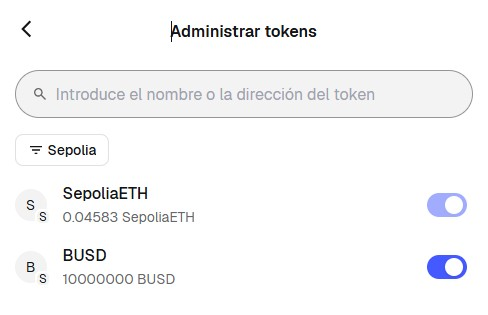
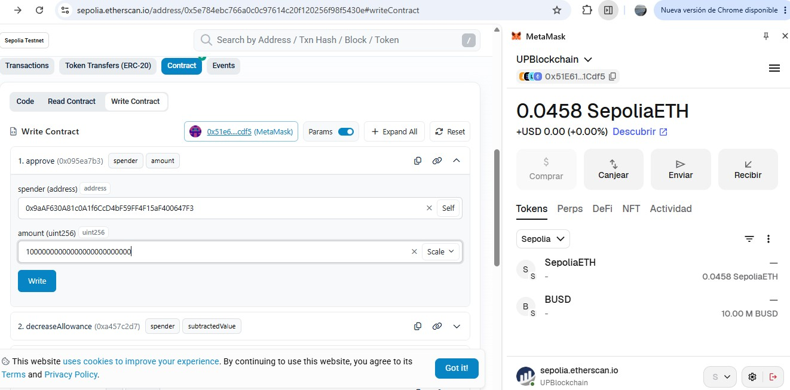
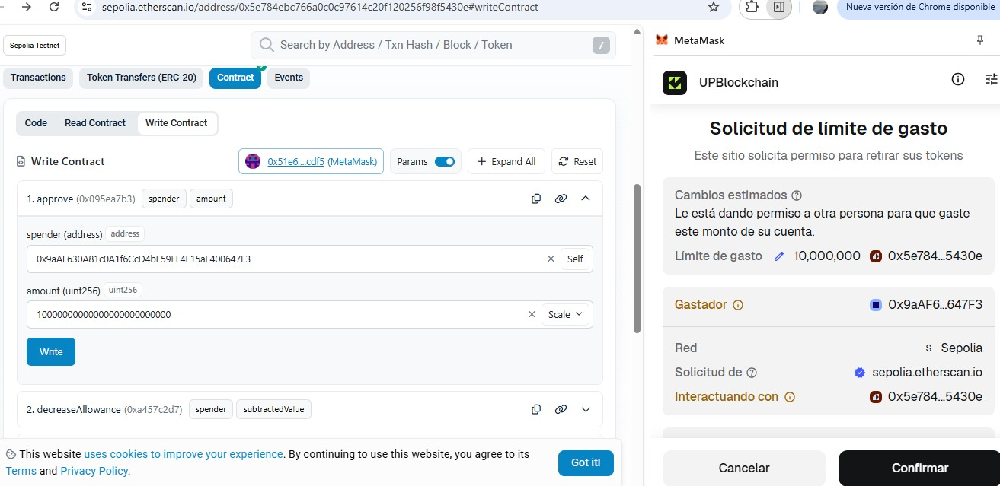
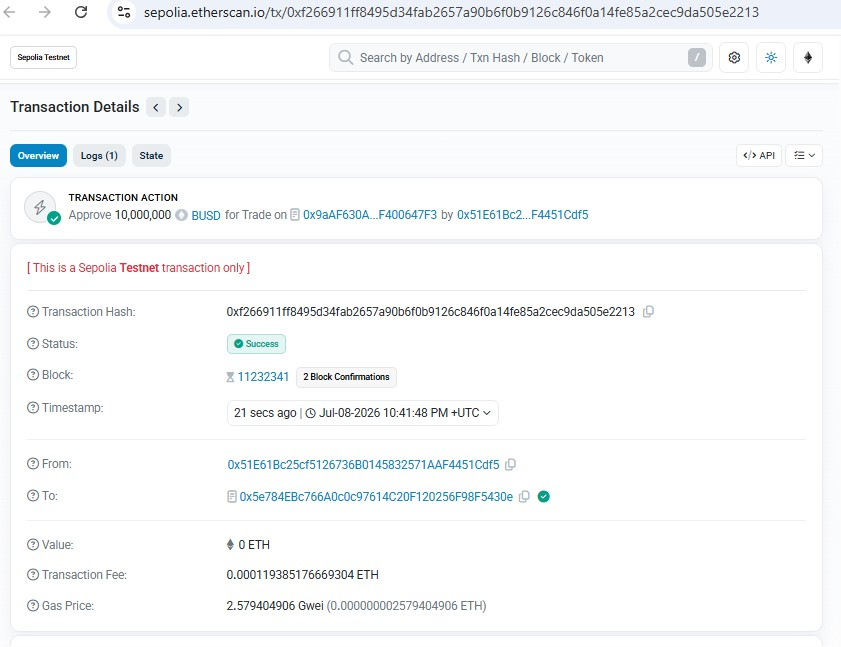
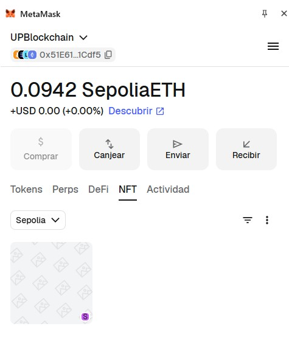
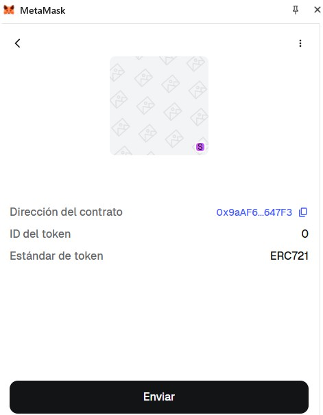

---

## 📦 Entrega del Proyecto Final

### Contratos desplegados en Sepolia

| Contrato | Dirección | Enlace Etherscan |
|---|---|---|
| **BUSD** (ERC-20) | `0x5e784EBc766A0c0c97614C20F120256F98F5430e` | [Ver en Sepolia Etherscan](https://sepolia.etherscan.io/address/0x5e784EBc766A0c0c97614C20F120256F98F5430e) |
| **CCNFT** (ERC-721) | `0x9aAF630A81c0A1f6CcD4bF59FF4F15aF400647F3` | [Ver en Sepolia Etherscan](https://sepolia.etherscan.io/address/0x9aAF630A81c0A1f6CcD4bF59FF4F15aF400647F3) |

Ambos contratos están **verificados** en Sepolia Etherscan.

### Interacciones realizadas

En el contrato **CCNFT**, se pueden verificar las siguientes transacciones (pestaña *Transactions*):

1. Setters ejecutados por el owner:
   - `setFundsCollector`
   - `setFeesCollector`
   - `setFundsToken` (apuntando al contrato BUSD)
   - `setCanBuy(true)`
   - `setMaxBatchCount(10)`
   - `setBuyFee(100)` — 1%
   - `setMaxValueToRaise(100000 * 10^18)`
   - `addValidValues(1 * 10^18)`
2. `approve` en el contrato BUSD para autorizar al CCNFT.
3. `buy(1 * 10^18, 1)` — compra del primer NFT (`tokenId 0`), con mint del NFT + transferencia del pago (1 BUSD) + comisión (0.01 BUSD).

### Capturas de pantalla

**BUSD importado en MetaMask** — 10.000.000 de tokens visibles en la red Sepolia:

**`approve` ejecutado en el contrato BUSD** — autoriza al CCNFT a gastar 10.000.000 BUSD:

**Setters del CCNFT ejecutados** — configuración del contrato antes del `buy`:

**Ejecución del `buy`** — compra del NFT con mint + transferencias de BUSD:

**NFT CCNFT importado en MetaMask** — Token ID 0, estándar ERC-721:

### Autor

Dario Avila